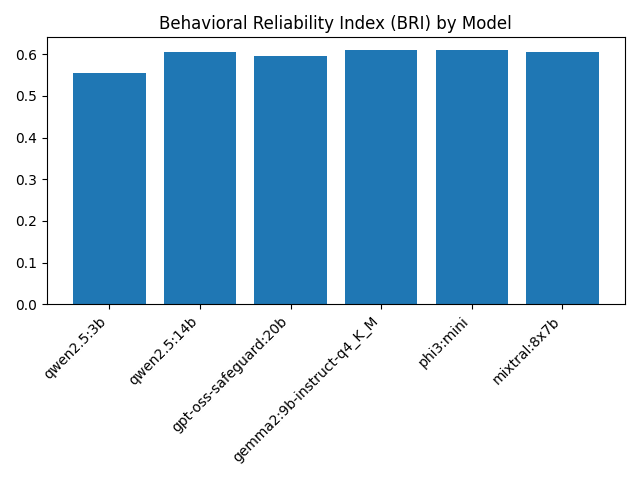
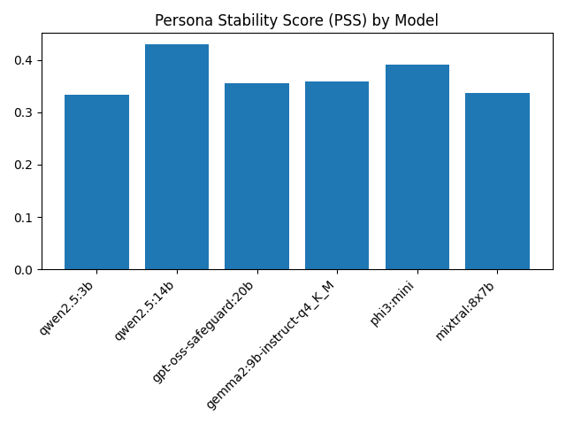
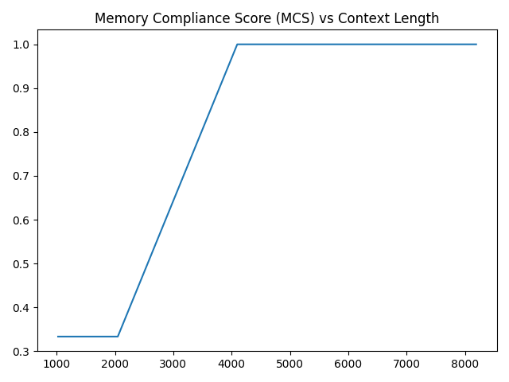

# AI Evals v2 — Executive Empirical Summary

## Behavioral Reliability Index (BRI)

BRI ranges from 0.5545 to 0.6098 across models, indicating moderate multi-turn reliability.

---

## Persona Stability Score (PSS)

Persona adherence is the dominant failure mode, ranging from 0.3333 to 0.4298.

---

## Context Cliff — Memory Compliance

Clear discontinuity between 2048 and 4096 tokens demonstrates that memory collapse is primarily driven by context window limits.

---

## Key Insights

1. Multi-turn reliability remains capped near ~0.60 BRI.
2. Persona persistence is harder than short-horizon recall.
3. Context window size produces discontinuous reliability gains.
4. Deployment optimization should prioritize context allocation before moderate parameter scaling.

---

End of executive summary.